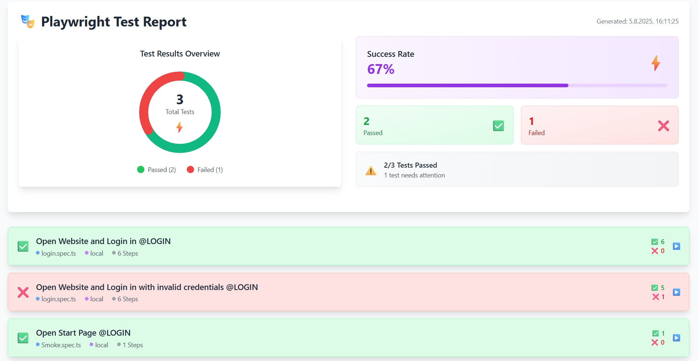

# PlaywrightTypeScriptFramework
Automated end-to-end testing project using Playwright and TypeScript. Tests run via GitHub Actions CI pipeline and generate detailed HTML reports. Ensures application stability by detecting issues early in development.

## Table of Contents
- [Project Structure & Development Guidelines](#project-structure--development-guidelines)
  - [Overview](#overview)
  - [Project Structure](#project-structure)
  - [File Organization & Storage](#file-organization--storage)
    - [Pages Directory (`/pages/`)](#pages-directory-pages)
    - [Specs Directory (`/specs/`)](#specs-directory-specs)
    - [Utils Directory (`/utils/`)](#utils-directory-utils)
  - [Naming Conventions](#naming-conventions)
    - [Page Classes](#page-classes)
    - [Page Variables/Locators](#page-variableslocators)
    - [Page Methods/Functions](#page-methodsfunctions)
    - [Assertion/Validation Methods](#assertionvalidation-methods)
    - [Method Parameters](#method-parameters)
  - [Development Rules](#development-rules)
  - [New Colaborators on this repo](#new-colaborators-on-this-repo)
- [Git Rules](#git-rules) !!!!!
- [Required Software Packages for Local Testing](#required-software-packages-for-local-testing)
- [Environment & Test-Tag Configuration and Test Execution](#environment--test-tag-configuration-and-test-execution)
  - [Environments](#environments)
    - [Available Environments](#available-environments)
    - [Environment Files](#environment-files)
    - [Creating New Environment](#creating-new-environment)
  - [Testing](#testing)
    - [Test-Tags and Grouping](#test-tags-and-grouping)
    - [Test Execution](#test-execution)
      - [Local](#local)
      - [Staging (Pipeline)](#staging-pipeline)
  - [Utils](#utils)
    - [Generate Test Documentation](#generate-test-documentation)
    - [User-Registry System](#user-registry-system)
- [Code Quality & Linting](#code-quality--linting)
  - [ESLint Configuration](#eslint-configuration)
  - [Local Testing](#local-testing)
  - [Pipeline Integration](#pipeline-integration)
- [GitHub Actions Workflows](#github-actions-workflows)
  - [Workflow Trigger](#workflow-trigger)
    - [Push and Pull](#push-and-pull)
    - [Gh CI Tool - Workflow_dispatch](#gh-ci-tool---workflow_dispatch)
      - [1. Generate a Personal Access Token in GitHub](#1-generate-a-personal-access-token-in-github)
      - [2. Store the Token as a GitHub Secret](#2-store-the-token-as-a-github-secret)
      - [3. Download and Install GitHub CLI](#3-download-and-install-github-cli)
      - [4. Authenticate GitHub CLI](#4-authenticate-github-cli)
- [Test Reports](#test-reports)
  - [Playwright HTML Report](#playwright-html-report)
  - [ESLint HTML Report](#eslint-html-report)
  - [Allure Report](#allure-report)
  - [Custom HTML Test Report](#custom-html-test-report)
- [TODO - Improve the Framework](#todo---improve-the-framework)

----

<br>

# Project Structure & Development Guidelines

## Overview
This Playwright TypeScript framework is designed for automated testing with a page object model pattern. All test components are organized in a clear structure to ensure maintainability and scalability.

## Project Structure
```
PlaywrightTypeScriptFramework/
├── components/        # Includes functions shared across all pages 
├── pages/             # Page Object Model classes
│   ├── BasePage.ts    # Base class (DO NOT MODIFY) - inherited components
│   └── *.Page.ts      # Individual page classes
├── specs/             # Test specification files
├── utils/             # Utility classes (StepLogger, etc.)
└── tests/             # Test execution files
```

### File Organization & Storage

#### Pages Directory (`/pages/`)
- **Purpose**: Contains all Page Object Model classes
- **Location**: Store all page classes here
- **Naming**: `[PageName]Page.ts` (e.g., `RegistrationPage.ts`, `LoginPage.ts`)
- **Base Class**: All pages must extend `BasePage` - **DO NOT MODIFY BasePage.ts**

#### Specs Directory (`/specs/`)
- **Purpose**: Contains test specification files
- **Location**: Store all test specs here
- **Naming**: `[FeatureName].spec.ts` (e.g., `registration.spec.ts`)

#### Utils Directory (`/utils/`)
- **Purpose**: Contains utility classes and helpers
- **Key Component**: `StepLogger` class for terminal logging and HTML reporting

### Naming Conventions

#### Page Classes
- **Class Name**: PascalCase ending with "Page" (e.g., `RegistrationPage`, `ProductSearchPage`)
- **File Name**: Same as class name with `.ts` extension

#### Page Variables/Locators
- **Visibility**: Must be `private`
- **Naming**: camelCase, descriptive (e.g., `private usernameInput`, `private submitButton`)

#### Page Methods/Functions
- **Naming**: PascalCase, self-explanatory function names
- **Examples**: 
  - `UsernameInputField()`
  - `SearchInputFieldForProducts()`
  - `ClickRegistrationButton()`

#### Assertion/Validation Methods
- **Rule**: Methods containing assertions or if statements for validation must start with "Check"
- **Examples**:
  - `CheckIfLogoutButtonIsNotAvailable()`
  - `CheckUserIsLoggedIn()`
  - `CheckProductIsDisplayed()`

#### Method Parameters
- **Standard Parameters**: All page methods should include:
  - `stepCount: number` - for step tracking
  - `testName: string` - for logging identification
  - Additional parameters as needed for the specific action

### Development Rules

1. **BasePage**: Never modify `BasePage.ts` - it contains core functionality
2. **StepLogger**: Always use `StepLogger` for logging - it generates both terminal output and HTML reports
3. **Error Handling**: All methods must include proper try-catch blocks with `StepLogger.logStepSuccess()` and `StepLogger.logStepFailed()`- URL methods uses `tepLogger.logStepPassedToOpenUrl` and `StepLogger.logStepFailedToOpenUrl()` (See BasePage)

4. **Method Structure**: Follow the established pattern:
  ```typescript
   async MethodName(parameters: type, stepCount: number, testName: string): Promise<void> {

       const methodName = this.MethodName.name;

       try {
           // Method logic (await this.methodName.fill(username); see initialization in BasePage)
            await StepLogger.logStepSuccess(this.fileName, methodName, testName, stepCount);
       } catch (error) {

            const errorMessage = error instanceof Error ? error.message : 'Unknown error';

            await StepLogger.logStepFailed(
                this.fileName, 
                methodName, 
                testName, 
                stepCount, 
                this.methodName
            );
            
            StepLogger.testEnd();
            throw new Error(`Error deteils : ${errorMessage}`);
       }
   }
   ```

### New Colaborators on this repo

When adding new test components:

1. **New Page Class**: Create in `/pages/` directory following naming conventions
2. **New Test Spec**: Create in `/specs/` directory
3. **Follow Templates**: Use existing page classes as templates for structure
4. **Logging**: Always implement proper StepLogger integration
5. **Validation Methods**: Remember to prefix assertion methods with "Check"

This structure ensures consistency, maintainability, and clear reporting across all test automation efforts.

## Git Rules

### Cloning and Branching

1. Clone repository
2. Create your own branch e.g. feature/branch-name <br>
`git checkout -b feature/branch-name` (create new branch and check out)
3. Only work in your own branch !!

### Creating Pull/Merge Request

4. Add files to Git <br>
`git add <file>`<br>
`git add . (all files)`
5. Commit changes <br> `git commit -m "meaningful commit name"`
6. Push current branch as upstream branch (remote) - Only the first time <br>
`git push --set-upstream origin feature/branch-name`

7. If remote branch is already created, simply use <br>
`git push`


Remove files from Git (if already added with `git add`)
``` 
git rm --cached file1 file2
git rm -r --cached folderName
```

### GitIgnore

The `.gitignore` file is configured to exclude files and directories that should not be tracked by Git. This ensures a clean repository and prevents sensitive or generated files from being committed.

### Excluded Files and Directories:

- **Test Results & Reports:**
  - `test-results/` - Playwright test output and traces
  - `allure-report/` - Generated Allure HTML reports
  - `allure-results/` - Raw Allure test data
  - `playwright-report/` - Playwright HTML reports
  - `test-reports/` - Containing custom reports

**Temporary Files:**
    - `temp/` - Temporary files and intermediate data generated during test runs


- **Dependencies & Build Artifacts:**
  - `node_modules/` - npm dependencies
  - `*.log` - Log files

- **Environment & State Files:**
  - `loggedInState.json` - User session state for authenticated tests
  - `notLoggedInState.json` - User session state for non-authenticated tests


## Required Software Packages for Local Testing

After cloning the repository, all dependencies must first be installed:

| Command                  | Description                           | What gets installed                                                                                 |
|--------------------------|---------------------------------------|-----------------------------------------------------------------------------------------------------|
| `npm install`            | Installs all Node.js packages        | Playwright, ESLint, TypeScript, Allure, cross-env and all other dependencies defined in `package.json` |
| `npx playwright install` | Downloads browser binaries           | Chromium, Firefox and WebKit browsers for test execution                                           |
| `npm install xlsx`       | Installs Excel support for Registry  | The `xlsx` package for processing and exporting user data as Excel files (called during user registration) |

## Environment & Test-Tag Configuration and Test Execution

### Environments

The project supports multiple environments through `.env` files and npm scripts for flexible test execution.
(These are not GitHub environments!)

#### Available Environments

- **local**   - Local tests with visible browser (HEADLESS=false) 
- **staging** - Pipeline tests without browser (HEADLESS=true)

**Important**: If the IP address changes (local) or the staging URL changes (different GitHub Page URL) - the envs must be adjusted.

### Creating New Environment

1. Create a new `.env.XXX` file with the environment name e.g. `.env.prod` in the root directory.
2. Fill the env file with the variables `BASE_URL` and `HEADLESS` (Only these envs are implemented so far 2025-07-23 rerd)
3. Update `utils/environment-config.ts`: In the `getDefaultBaseURL()` function, add a new `case` for your environment, specifying both the return URL and the fallback URL as needed.

## Testing

### Test-Tags and Grouping

This project uses tags for grouping and filtering test cases. Each test case has a specific tag like `@TC-10001`, where the first digit represents the category and the following numbers represent the test number. Furthermore, tags like `@Login` and `@Smoke-Test` are used. Additional tags are not yet defined. The currently available tags and their assignments can be viewed at any time in the generated test documentation.

 Folder 📁 [`utils/test-documentation`](./utils/test-documentation)

### Test Execution

Test execution is done through various npm scripts, each using a specific environment or filtering. By default, all tests are executed, but additional options allow targeted selection of individual tests, test tags, or environments. Control is done through the configuration in `playwright.config.ts` as well as the respective `.env` files. For targeted execution of individual tests or test groups, flexible commands are available that enable quick adaptation to different test requirements.

### Local
```bash
npm run test:local 
# Example: Runs all tests in the local environment (HEADLESS=false)

npm run test:local login.spec.ts:24
# Example: Runs a specific test from login.spec.ts (line 24) in the local environment (HEADLESS=false)

npm run test:local:tc "@TC-10001"
# Example: Runs the test with number TC-10001 (TC can have multiple tags but only the single one is selected)

npm run test:local:tag "@login"
# Example: Runs the test(s) with the tag @login (TC can have multiple tags but only the single one is selected)


npm run test:local:tag "@Smoke-Test @login"
# Example: Runs the test(s) - IMPORTANT: The *tags must be consecutive in the test title* otherwise the tests will not be found

```

### Staging (Pipeline)

```bash

npm run test:staging
# Example: Runs all tests in the staging environment (HEADLESS=true)

npm run test:staging login_staging.spec.ts:34
# Example: Runs a specific test from login_staging.spec.ts (line 34) in the staging environment (HEADLESS=true)

npm run test:staging:headed
# Example: Runs all in visible browser / (HEADLESS=false) not for pipeline, only for debugging

npm run test:staging:tc "@TC-10001"
# Example: Runs the test with number TC-10001 (TC can have multiple tags but only the single one is selected)

npm run test:local:tag "@login"
# Example: Runs all tests with tag "@login" in the local environment (TC can have multiple tags but only the single one is selected)

npm run test:staging:tag:headed "@Login"
# Example: Runs all tests with tag "@Login" /(HEADLESS=false) not for pipeline, only for debugging

npm run test:staging:tag "@Smoke-Test @login"
# Example: Runs the test(s) - IMPORTANT: The *tags must be consecutive in the test title* otherwise the tests will not be found

```

## Utils

### Generate Test Documentation

The project contains an automatic tool for generating an overview table of all test cases:

#### generate-test-table.ts

- **Purpose:** Creates a clear Markdown table with all available test cases from the entire project.

**What is generated:**
- **Test Case Overview:** Complete list of all tests with names, file locations, and line numbers
- **Tag Overview:** All used test tags (e.g. `@login`, `@Smoke-Test`...)
- **Timestamp:** Automatic versioning of generated reports

#### Execution

```bash
npm run test-table
```

#### Generated Files

- **Storage Location:** `utils/test-documentation/YYYY-MM-DD_HH_MM_test-table.md`

#### Playwright Test Cases Overview

The overview of the Testcases (last run of `npm run test-tabke`) can be found in the folder 📁 [`utils/test-documentation`](./utils/test-documentation)


#### Benefits of Test Documentation

1. **Complete Overview:** All test cases at a glance
2. **Tag Management:** Overview of all used test tags for better categorization
3. **Documentation:** Automatically generated documentation for code reviews and onboarding
4. **Versioning:** Timestamped reports for history tracking

The tool automatically parses all `.spec.ts` files in the `tests/` directory and creates a structured overview of available test cases.

### User-Registry System

The project contains an automatic system for managing and logging registered users during test execution:

#### user-registry.ts

**Purpose:** Automatic storage of all successfully registered test users in a CSV file for local tracking.

**Functions:**
- **Automatic logging** of all registered users from registration tests
- **CSV format** with creation date, username, password, and environment
- **Environment detection** based on BASE_URL (local, staging, demo, production)
- **Historical recording** - new users are appended to existing file
- **Statistics** about registered users by environment

#### Integration in Tests

The system is automatically called in the test `Registration successfully @TC-20000`:

```typescript
import { userRegistry } from '../utils/user-registry';

// Automatic call after successful registration
userRegistry.addUser(username, password, baseUrl);
```

#### Local Usage

**⚠️ Important:** This system is only intended for **local development**!

```bash
# Install required dependencies for Excel support
npm install xlsx

# Run tests (User registry is automatically populated)
npm run test:local registration.spec.ts

```

#### Generated Files

**Storage Location:** `utils/registered-users/`
- `registered-users.csv` - CSV file with all registered users (new users will be attached)

**CSV Format:**
```csv
Creation Date,Username,Password,Environment
2025-01-18,testuser123,SecurePass123!,local
2025-01-18,anotheruser,MyPassword456@,staging
```

#### Privacy & Git Handling

- All files in `utils/registered-users/` are listed in `.gitignore`
- **Please do not** commit user data to the repository
- System is exclusively intended for local test documentation

#### Benefits

1. **Local User History:** Complete recording of all test registrations
2. **Environment Tracking:** Track which users were created in which environment
3. **Test Data Management:** Easy overview of available test users
4. **Debugging Support:** Helps with tracking test problems
5. **Excel Integration:** Optional Excel export for extended data analysis


## Code Quality & Linting

The project uses **ESLint** for static code analysis and ensuring consistent code quality. ESLint checks TypeScript and JavaScript files for syntax errors, code style violations, and potential bugs.

### ESLint Configuration

#### Required Files

The following files are necessary for ESLint configuration:

| File | Purpose | Description |
|------|---------|-------------|
| `eslint.config.mjs` | **Main Configuration** | ESLint v9 Flat Config with TypeScript rules |
| `package.json` | **Scripts Definition** | Defines npm scripts for linting commands |
| `tsconfig.json` | **TypeScript Config** | TypeScript configuration for type checking |
| `.gitignore` | **Ignore Rules** | Excludes ESLint reports from Git tracking |

#### ESLint Configuration Details (`eslint.config.mjs`)

```javascript
import js from '@eslint/js';
import globals from 'globals';
import tsParser from '@typescript-eslint/parser';
import tsPlugin from '@typescript-eslint/eslint-plugin';

export default [
  {
    files: ['**/*.{js,mjs,cjs,ts,tsx}'],
    languageOptions: {
      parser: tsParser,
      parserOptions: {
        ecmaVersion: 'latest',
        sourceType: 'module'
      },
      globals: { ...globals.browser, ...globals.node }
    },
    plugins: { '@typescript-eslint': tsPlugin },
    rules: {
      '@typescript-eslint/no-unused-vars': ['warn', { 'argsIgnorePattern': '^_' }],
      '@typescript-eslint/no-explicit-any': 'warn',
      // ... additional rules
    }
  }
];
```

### Local Testing

#### NPM Scripts

The project provides the following npm scripts for local linting:

```bash
# Check all files for ESLint rules
npm run lint

# Automatic fixing of fixable problems
npm run lint:fix

# Generate HTML report (eslint-reports/eslint-report.html)
# ⚠️ Works even with ESLint errors!
npm run lint:report

# TypeScript type checking (without compilation)
npm run type-check
```

#### Technical Background of HTML Reports:

The `lint:report` script is entered in the `"scripts"` section of the `package.json` file.  
This allows the HTML report for ESLint to be generated at any time with `npm run lint:report` – even when linting errors occur.

**Recommended Procedure:**
1. Add the script to `package.json` under `"scripts"`.
2. After regular linting (`npm run lint`), run the report script to get a current HTML report.

**Example entry in `package.json`:**
```json
"scripts": {
  "lint": "eslint .",
  "lint:fix": "eslint . --fix",
  "lint:report": "node -e \"const fs = require('fs'); const { execSync } = require('child_process'); if (!fs.existsSync('eslint-reports')) fs.mkdirSync('eslint-reports', { recursive: true }); try { execSync('eslint . --format html --output-file eslint-reports/eslint-report.html', { stdio: 'inherit' }); } catch(e) { console.log('ESLint report generated with', e.status, 'issues found'); }\""
}
```

The `lint:report` script uses special Node.js logic to **always** generate the HTML report – regardless of whether errors are found.

```json
{
  "lint:report": "node -e \"const fs = require('fs'); const { execSync } = require('child_process'); if (!fs.existsSync('eslint-reports')) fs.mkdirSync('eslint-reports', { recursive: true }); try { execSync('eslint . --format html --output-file eslint-reports/eslint-report.html', { stdio: 'inherit' }); } catch(e) { console.log('ESLint report generated with', e.status, 'issues found'); }\""
}
```

**What happens:**
1. **Create directory**: `eslint-reports/` is automatically created
2. **Run ESLint**: With HTML format and output file
3. **Catch errors**: Report is still generated when ESLint errors occur
4. **Output status**: Shows whether problems were found


### Pipeline Integration

#### GitHub Actions Workflow

ESLint is integrated into the CI/CD pipeline and runs **before** Playwright tests:

```yaml
jobs:
  lint:
    name: Code Linting
    runs-on: ubuntu-latest
    steps:
      - name: Check out code
        uses: actions/checkout@v4
      - name: Set up Node.js
        uses: actions/setup-node@v4
        with:
          node-version: '20'
      - name: Install dependencies
        run: npm ci
      - name: Run ESLint
        run: npm run lint

  test:
    needs: lint  # Tests only run on successful linting
    # ... additional test steps
```

#### ESLint Report as GitHub Artifact:

After each pipeline run, an **interactive HTML report** is created:

1. **Go to GitHub Actions** → Your workflow run
2. **Scroll to "Artifacts"** at the bottom of the page
3. **Download "eslint-report"** (eslint-report.zip)
4. **Extract and open** `eslint-reports/eslint-report.html` in browser

#### Benefits of Pipeline Integration:

1. **Early Error Detection**: Code problems are detected before tests
2. **Consistent Code Quality**: All commits must meet linting standards
3. **Automated Reports**: ESLint results are available as artifacts
4. **Efficient Resource Usage**: Tests only run on clean code
5. **📊 Interactive HTML Reports**: Easy analysis of code problems

## GitHub Actions Workflows

### Workflow Trigger:

#### Push and Pull
- Push from local feature branch to `main` or `master` branch
- Pull requests from local feature branch to `main` or `master` branch  
- Manually via GitHub Actions UI

### Gh CI Tool - Workflow_dispatch

You can use the GitHub CLI (`gh`) tool to manually trigger GitHub Actions workflows from your terminal. Follow these steps:

#### 1. Generate a Personal Access Token in GitHub

- Go to **GitHub → Settings → Developer settings → Personal access tokens** (https://github.com/settings/tokens) 
- Click **"Generate new token"** ( Fine-granted-repo-scope)
- Set `Token name`.
- Set `Description (Optinal)`
- Set ``Expiration date``
- Set `Repository acess` (Public, All repos, Only select repos )
- Copy and save the token securely.

#### 2. Store the Token as a GitHub Secret

- In your repository, go to **Settings → Secrets and variables → Actions**.
- Click **"New repository secret"**.
- Name it (e.g., `GH_TOKEN`) and paste your token.

#### 3. Download and Install GitHub CLI

- Download from: [https://cli.github.com/](https://cli.github.com/)
- Install using the instructions for your OS.

#### 4. Authenticate GitHub CLI

```bash
gh auth login

PS C:\xx\xx\xx\xx> gh auth login
? Where do you use GitHub? -->  GitHub.com
? What is your preferred protocol for Git operations on this host? -->  HTTPS
? Authenticate Git with your GitHub credentials? --> Yes
? How would you like to authenticate GitHub CLI? --> Login with a web browser

! First copy your one-time code: XXXX-XXXX --> Paste it in GitHub.com

```

#### 5. Trigger a Workflow Manually

List available workflows:
```bash
gh workflow list
```

Trigger a workflow by name or file:
```bash
gh workflow run <workflow_file.yml>
```
Or, if you know the workflow name:
```bash
gh workflow run "<workflow name>"
```

Check workflow run status:
```bash
gh run list
```

**Tip:**  
You must have push or workflow permissions to trigger workflows via CLI.


## Test Reports

The project generates various types of test reports for local development and CI/CD pipelines.


### Playwright HTML Report

**Automatic Generation:** After each test run, Playwright automatically creates a detailed HTML report.

### Configure Playwright Report

To configure the Playwright HTML report, adjust the `playwright.config.ts` file. There you can activate reporting and set additional options.

**Example Configuration (`playwright.config.ts`):**
```typescript
import { defineConfig, devices } from '@playwright/test';

export default defineConfig({
  reporter: [
    ['html', { outputFolder: 'playwright-report', open: 'never' }]
  ],
  // Additional options like testDir, retries, etc.
  use: {
    trace: 'on-first-retry',
    screenshot: 'only-on-failure',
    video: 'retain-on-failure'
  }
});
```

**Important Fields:**
- `reporter`: Specifies that an HTML report is generated and where it is stored.
- `outputFolder`: Target folder for the report (default: `playwright-report`).
- `open`: Controls whether the report is automatically opened after test run (`never`, `on-failure`, `always`).

**Additional adjustments** can be made in the same file, e.g. for traces, screenshots or video recordings.

**File Path:**  
`playwright.config.ts` (in project root)

**Tip:**  
After changes to the configuration, simply run the tests again to generate the report with the new settings.


#### Local Usage:

```bash
# Run tests (automatically generates report)
npx playwright test

# Open report in browser
npx playwright show-report
```

**Report Storage Location:** `playwright-report/index.html`

#### CI/CD Pipeline:

In GitHub Actions, the Playwright report is automatically uploaded as artifact:

```yaml
- name: Upload Playwright Report
  if: ${{ !cancelled() }}
  uses: actions/upload-artifact@v4
  with:
    name: playwright-report
    path: playwright-report/
    retention-days: 30
```

**Download:** Actions → Workflow Run → "Artifacts" → "playwright-report"

### Custom HTML Test Report

**Advanced Test Reports:** The framework generates custom HTML dashboards with visual ring diagrams and detailed test metrics in addition to standard Playwright reports




Draft-Version

**Features:**
- Ring diagram for test summary (Passed/Failed/Skipped)
- Consolidated reports for multiple test specifications
- Responsive design with Tailwind CSS
- Collapsible test details with screenshots
- Animation and interactive elements

#### Technical Implementation:

**Components:**
- `utils/ReportManager.ts`: Persistent storage of test data across multiple specifications
- `utils/HtmlReportGenerator.ts`: Generates the visual dashboard with SVG ring charts
- `utils/StepLogger.ts`: Coordinates report generation

**Global Setup:** Configured in `playwright.config.ts` for consolidated reports:
```typescript
export default defineConfig({
  globalTeardown: require.resolve('./utils/GlobalTeardown.ts'),
  // ... additional configuration
});
```

#### Local Usage:

```bash
# Run tests (automatically generates Custom HTML Report)
npm run test

# Open Custom HTML Report in browser (replace timestamp and environment with actual values)
start test-reports/YYYY-MM-DD_HH-MM-SS_Environment.html
```

**Report Storage Location:** `test-reports/YYYY-MM-DD_HH-MM-SS_Environment.html`

#### CI/CD Pipeline:

Custom HTML Reports are automatically uploaded as GitHub Actions Artifacts:

```yaml
    - name: Upload Custom HTML Test Report
      if: ${{ !cancelled() }}
      uses: actions/upload-artifact@v4
      with:
        name: custom-html-test-report
        path: test-reports/
        retention-days: 30
        if-no-files-found: warn
```

**Download:** Actions → Workflow Run → "Artifacts" → "custom-html-test-report" or "custom-html-test-report-registration"

**Benefits:**
- All test specifications consolidated in one report
- Visual ring diagrams for quick overview  
- Persistent storage as GitHub Artifacts for 30 days
- Direct download and local viewing possible
- Timestamped filenames with environment information for better organization

### ESLint HTML Report

**Generation on Request:** HTML report for code quality analysis.

#### Local Usage:

```bash
# Generate ESLint HTML report
npm run lint:report

# Open report
# File: eslint-reports/eslint-report.html
```

#### CI/CD Pipeline:

The ESLint report is generated in every pipeline run:

```yaml
- name: Generate ESLint HTML Report
  if: always()
  run: npm run lint:report
  continue-on-error: true

- name: Upload ESLint Report
  if: always()
  uses: actions/upload-artifact@v4
  with:
    name: eslint-report
    path: eslint-reports/
```

**Download:** Actions → Workflow Run → "Artifacts" → "eslint-report"

#### Report Contents:

After execution, the following artifacts are automatically generated:

1. **Playwright HTML Report** - Detailed test results with screenshots
2. **ESLint HTML Report** - Code quality analysis with interactive overview
3. **Allure Report** - Extended reports (if configured)

These can be downloaded from the GitHub Actions page.

### Allure Report

**Automatic Generation:** After each test run, Playwright can save results in Allure format, which are then processed into an HTML report.

#### Configure Allure Report

To activate Allure reports, adjust the `playwright.config.ts` file and install the necessary reporter package (`allure-playwright`). Example:

**Example Configuration (`playwright.config.ts`):**
```typescript
import { defineConfig, devices } from '@playwright/test';

export default defineConfig({
  reporter: [
    ['allure-playwright']
  ],
  // Additional options like testDir, retries, etc.
});
```

**Important Fields:**
- `reporter`: Adds the Allure reporter.
- Results are stored in the `allure-results/` folder.

**Additional adjustments** can be made in the same file, e.g. for traces, screenshots or video recordings.

**File Path:**  
`playwright.config.ts` (in project root)

**Tip:**  
After changes to the configuration, simply run the tests again to generate new Allure results.

#### Local Usage:

```bash
# Run tests (automatically generates Allure results)
npx playwright test

# Generate Allure report
allure generate allure-results --clean -o allure-report

# Open report in browser
allure open allure-report
```

**Report Storage Location:** `allure-report/index.html`

#### CI/CD Pipeline:

In GitHub Actions, the Allure report can be automatically uploaded as artifact:

```yaml
- name: Generate Allure Report
  if: always()
  run: allure generate allure-results --clean -o allure-report

- name: Upload Allure Report
  if: always()
  uses: actions/upload-artifact@v4
  with:
    name: allure-report
    path: allure-report/
    retention-days: 30
```

## TODO - Improve the Framework

### Tests and Pages

- [ ] Fix lint problems
- [ ] Complete all pages
- [ ] Complete all test specs
- [ ] Generate 10 Test for every test specs


### Reporting

- [ ] Fix reporting (Custom Report). At the moment, when a step fails, the test stops, and the Logger only shows all steps up to the failed step. The remaining steps are skipped and are not counted in the hrml report.

### CI/CD

- [x] Adding Workflow_dipatch to execute playwright.yml per ci tool
- [ ] Generate reusable Docker image and use it in the pipeline

