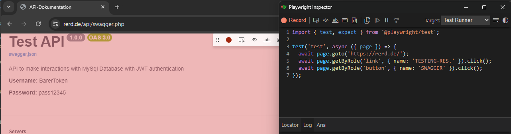

# PlaywrightTypeScriptFramework
Automated end-to-end testing project using Playwright and TypeScript. Tests are executed via GitHub Actions CI pipeline and generate detailed HTML reports. The framework helps ensure application stability by detecting issues early in development.

## Test Object
This framework tests an ecommerce website developed by myself: [https://rerd.de/testing-website/](https://rerd.de/testing-website/)

Main features covered:
- User registration and login
- Add products to cart and place orders
- Edit user profile data
- Many additional functionalities for user interaction

## Table of Contents
- [Project Structure & Development Guidelines](#project-structure--development-guidelines)
  - [Overview](#overview)
  - [Project Structure](#project-structure)
  - [File Organization & Storage](#file-organization--storage)
    - [Pages Directory (`/pages/`)](#pages-directory-pages)
    - [Specs Directory (`/specs/`)](#specs-directory-specs)
    - [Utils Directory (`/utils/`)](#utils-directory-utils)
  - [Naming Conventions](#naming-conventions)
    - [Page Classes](#page-classes)
    - [Page Variables/Locators](#page-variableslocators)
    - [Page Methods/Functions](#page-methodsfunctions)
    - [Assertion/Validation Methods](#assertionvalidation-methods)
    - [Method Parameters](#method-parameters)
  - [Development Rules](#development-rules)
  - [New Colaborators on this repo](#new-colaborators-on-this-repo)
- [Git Rules](#git-rules) !!!!!
- [Required Software Packages for Local Testing](#required-software-packages-for-local-testing)
- [Environment & Test-Tag Configuration and Test Execution](#environment--test-tag-configuration-and-test-execution)
  - [Environments](#environments)
    - [Available Environments](#available-environments)
    - [Environment Files](#environment-files)
    - [Creating New Environment](#creating-new-environment)
  - [Testing (Local)](#testing--Local-)
    - [Test-Tags and Grouping](#test-tags-and-grouping)
    - [Test Execution](#test-execution)
      - [Prod](#prod)
- [Useful Tools](#useful-tools)
  - [Playwright Codegen (UI-Tool speed up locator analyse)](#playwright-codegen-ui-tool-speed-up-locator-analyse)
- [Code Quality & Linting](#code-quality--linting)
  - [ESLint Configuration](#eslint-configuration)
  - [Local Testing](#local-testing)
  - [Pipeline Integration](#pipeline-integration)
- [CI/CD Workflows](#cicd-workflows)
  - [Github Actions Workflow and Trigger](#github-actiosn-workflow-and-trigger)
    - [Push and Pull](#push-and-pull)
    - [Gh CI Tool - Workflow_dispatch](#gh-ci-tool---workflow_dispatch)
      - [1. Generate a Personal Access Token in GitHub](#1-generate-a-personal-access-token-in-github)
      - [2. Store the Token as a GitHub Secret](#2-store-the-token-as-a-github-secret)
      - [3. Download and Install GitHub CLI](#3-download-and-install-github-cli)
      - [4. Authenticate GitHub CLI](#4-authenticate-github-cli)
  - [Jenkins](#jenkins)
    - [Introduction to Jenkins](#introduction-to-jenkins)
    - [How to Create a Pipeline Job in Jenkins](#how-to-create-a-pipeline-job-in-jenkins)
      - [1. Install and Setup Jenkins](#1-install-and-setup-jenkins)
      - [2. Create a New Pipeline Job from SCM](#2-create-a-new-pipeline-job-from-scm)
    - [Jenkins Pipeline Parameters](#jenkins-pipeline-parameters)
      - [Parameter Configuration](#parameter-configuration)
      - [Parameter Usage Examples](#parameter-usage-examples)
      - [Running Tests with Parameters](#running-tests-with-parameters)
    - [Jenkins Pipeline Stages](#jenkins-pipeline-stages)
    - [Test Reports Integration](#test-reports-integration)
      - [1. JUnit XML Reports](#1-junit-xml-reports)
      - [2. Playwright HTML Reports](#2-playwright-html-reports)
      - [3. Content Security Policy (CSP) Configuration](#3-content-security-policy-csp-configuration)
      - [4. ZIP Artifacts](#4-zip-artifacts)
    - [What You'll See After Build Completion](#what-youll-see-after-build-completion)
      - [Jenkins Build Dashboard](#jenkins-build-dashboard)
      - [Test Results View](#test-results-view)
      - [Playwright HTML Report View](#playwright-html-report-view)
    - [Email Notifications](#email-notifications)
      - [Gmail App Password Configuration](#gmail-app-password-configuration)
    - [Build Status Understanding](#build-status-understanding)
    - [Troubleshooting](#troubleshooting)
    - [Best Practices](#best-practices)
- [Test Reports](#test-reports)
  - [Playwright HTML Report](#playwright-html-report)
  - [ESLint HTML Report](#eslint-html-report)
  - [Allure Report](#allure-report)
  - [Custom HTML Test Report](#custom-html-test-report)
- [TODO - Improve the Framework](#todo---improve-the-framework)

----

<br>

# Project Structure & Development Guidelines

## Overview
This Playwright TypeScript framework is designed for automated testing with a page object model pattern. All test components are organized in a clear structure to ensure maintainability and scalability.

## Project Structure
```
PlaywrightTypeScriptFramework/
├── components/        # Includes functions shared across all pages 
├── pages/             # Page Object Model classes
│   ├── BasePage.ts    # Base class (DO NOT MODIFY) - inherited components
│   └── *.Page.ts      # Individual page classes
├── specs/             # Test specification files
├── utils/             # Utility classes (StepLogger, etc.)
└── tests/             # Test execution files
```

### File Organization & Storage

#### Pages Directory (`/pages/`)
- **Purpose**: Contains all Page Object Model classes
- **Location**: Store all page classes here
- **Naming**: `[PageName]Page.ts` (e.g., `RegistrationPage.ts`, `LoginPage.ts`)
- **Base Class**: All pages must extend `BasePage` - **DO NOT MODIFY BasePage.ts**

#### Specs Directory (`/specs/`)
- **Purpose**: Contains test specification files
- **Location**: Store all test specs here
- **Naming**: `[FeatureName].spec.ts` (e.g., `registration.spec.ts`)

#### Utils Directory (`/utils/`)
- **Purpose**: Contains utility classes and helpers
- **Key Component**: `StepLogger` class for terminal logging and HTML reporting

### Naming Conventions

#### Page Classes
- **Class Name**: PascalCase ending with "Page" (e.g., `RegistrationPage`, `ProductSearchPage`)
- **File Name**: Same as class name with `.ts` extension

#### Page Variables/Locators
- **Visibility**: Must be `private`
- **Naming**: camelCase, descriptive (e.g., `private usernameInput`, `private submitButton`)

#### Page Methods/Functions
- **Naming**: PascalCase, self-explanatory function names
- **Examples**: 
  - `UsernameInputField()`
  - `SearchInputFieldForProducts()`
  - `ClickRegistrationButton()`

#### Assertion/Validation Methods
- **Rule**: Methods containing assertions or if statements for validation must start with "Check"
- **Examples**:
  - `CheckIfLogoutButtonIsNotAvailable()`
  - `CheckUserIsLoggedIn()`
  - `CheckProductIsDisplayed()`

#### Method Parameters
- **Standard Parameters**: All page methods should include:
  - `stepCount: number` - for step tracking
  - `testName: string` - for logging identification
  - Additional parameters as needed for the specific action

### Development Rules

1. **BasePage**: Never modify `BasePage.ts` - it contains core functionality
2. **StepLogger**: Always use `StepLogger` for logging - it generates both terminal output and HTML reports
3. **Error Handling**: All methods must include proper try-catch blocks with `StepLogger.logStepSuccess()` and `StepLogger.logStepFailed()`- URL methods uses `tepLogger.logStepPassedToOpenUrl` and `StepLogger.logStepFailedToOpenUrl()` (See BasePage)

4. **Method Structure**: Follow the established pattern:
  ```typescript
   async MethodName(parameters: type, stepCount: number, testName: string): Promise<void> {

       const methodName = this.MethodName.name;

       try {
           // Method logic (await this.methodName.fill(username); see initialization in BasePage)
            await StepLogger.logStepSuccess(this.fileName, methodName, testName, stepCount);
       } catch (error) {

            const errorMessage = error instanceof Error ? error.message : 'Unknown error';

            await StepLogger.logStepFailed(
                this.fileName, 
                methodName, 
                testName, 
                stepCount, 
                this.methodName
            );
            
            StepLogger.testEnd();
            throw new Error(`Error deteils : ${errorMessage}`);
       }
   }
   ```

### New Colaborators on this repo

When adding new test components:

1. **New Page Class**: Create in `/pages/` directory following naming conventions
2. **New Test Spec**: Create in `/specs/` directory
3. **Follow Templates**: Use existing page classes as templates for structure
4. **Logging**: Always implement proper StepLogger integration
5. **Validation Methods**: Remember to prefix assertion methods with "Check"

This structure ensures consistency, maintainability, and clear reporting across all test automation efforts.

## Git Rules

### Cloning and Branching

1. Clone repository
2. Create your own branch e.g. feature/branch-name <br>
`git checkout -b feature/branch-name` (create new branch and check out)
3. Only work in your own branch !!

### Creating Pull/Merge Request

4. Add files to Git <br>
`git add <file>`<br>
`git add . (all files)`
5. Commit changes <br> `git commit -m "meaningful commit name"`
6. Push current branch as upstream branch (remote) - Only the first time <br>
`git push --set-upstream origin feature/branch-name`

7. If remote branch is already created, simply use <br>
`git push`


Remove files from Git (if already added with `git add`)
``` 
git rm --cached file1 file2
git rm -r --cached folderName
```

### GitIgnore

The `.gitignore` file is configured to exclude files and directories that should not be tracked by Git. This ensures a clean repository and prevents sensitive or generated files from being committed.

### Excluded Files and Directories:

- **Test Results & Reports:**
  - `test-results/` - Playwright test output and traces
  - `allure-report/` - Generated Allure HTML reports
  - `allure-results/` - Raw Allure test data
  - `playwright-report/` - Playwright HTML reports
  - `test-reports/` - Containing custom reports

**Temporary Files:**
    - `temp/` - Temporary files and intermediate data generated during test runs


- **Dependencies & Build Artifacts:**
  - `node_modules/` - npm dependencies
  - `*.log` - Log files

- **Environment & State Files:**
  - `loggedInState.json` - User session state for authenticated tests
  - `notLoggedInState.json` - User session state for non-authenticated tests


## Required Software Packages for Local Testing

After cloning the repository, all dependencies must first be installed:

| Command                  | Description                           | What gets installed                                                                                 |
|--------------------------|---------------------------------------|-----------------------------------------------------------------------------------------------------|
| `npm install`            | Installs all Node.js packages        | Playwright, ESLint, TypeScript, Allure, cross-env and all other dependencies defined in `package.json` |
| `npx playwright install` | Downloads browser binaries           | Chromium, Firefox and WebKit browsers for test execution                                           |
| `npm install xlsx`       | Installs Excel support for Registry  | The `xlsx` package for processing and exporting user data as Excel files (called during user registration) |

## Environment & Test-Tag Configuration and Test Execution

### Environments

The project supports multiple environments through `.env` files and npm scripts for flexible test execution.
(These are not GitHub environments!)

#### Available Environments

- **prod**   - test on prod server 


### Creating New Environment

1. Create a new `.env.XXX` file with the environment name e.g. `.env.prod` in the root directory.
2. Fill the env file with the variables `BASE_URL` and `HEADLESS` (Only these envs are implemented so far 2025-07-23 rerd)
3. Update `utils/environment-config.ts`: In the `getDefaultBaseURL()` function, add a new `case` for your environment, specifying both the return URL and the fallback URL as needed.

## Testing (Local)

### Test-Tags and Grouping

This project uses tags for grouping and filtering test cases. Each test case has a specific tag like `@TC-10001`, where the first digit represents the category and the following numbers represent the test number. Furthermore, tags like `@Login` and `@Smoke-Test` are used. Additional tags are not yet defined. The currently available tags and their assignments can be viewed at any time in the generated test documentation.

 Folder 📁 [`utils/test-documentation`](./utils/test-documentation)

### Test Execution

Test execution is done through various npm scripts, each using a specific environment or filtering. By default, all tests are executed, but additional options allow targeted selection of individual tests, test tags, or environments. Control is done through the configuration in `playwright.config.ts` as well as the respective `.env` files. For targeted execution of individual tests or test groups, flexible commands are available that enable quick adaptation to different test requirements.

### Prod
```bash
npm run test:prod 
# Example: Runs all tests in the local environment (HEADLESS=false)

npm run test:prod login.spec.ts:24
# Example: Runs a specific test from login.spec.ts (line 24) in the local environment (HEADLESS=false)

npm run test:prod:tc "@TC-10001"
# Example: Runs the test with number TC-10001 (TC can have multiple tags but only the single one is selected)

npm run test:prod:tag "@login"
# Example: Runs the test(s) with the tag @login (TC can have multiple tags but only the single one is selected)

```

## Useful Tools

### Playwright Codegen (UI-Tool speed up locator analyse)

#### What is Playwright Codegen?

Playwright Codegen is a tool provided by Playwright to automatically generate test scripts by recording user interactions with a browser. It simplifies the creation of test cases by capturing actions like clicks, inputs, and navigation.

#### Required Software

To use Playwright Codegen, ensure the following software is installed:
- **Node.js**: Required to run Playwright.
- **Playwright**: Installed via `npm install playwright`.
- **Browsers**: Installed via `npx playwright install`.

#### How to Use Playwright Codegen

1. **Start Codegen**:
   Run the following command to start Playwright Codegen:
   ```bash
   npx playwright codegen
   ```
   This will open a browser window and a Playwright Inspector.

   Below is an example of the Playwright Codegen UI:



**NOTE:** You can choose between different frameworks (e.g., Python with Pytest, etc.).

2. **Record Actions**:
   - Interact with the browser as you would during a test (e.g., click buttons, fill forms, navigate pages).
   - The actions will be recorded and displayed in the Playwright Inspector.

3. **Save the Script**:
   - Once recording is complete, copy the generated script from the Inspector.

#### Playwright Codegen UI

The Playwright Codegen UI provides a visual interface to record and inspect user interactions. It consists of two main components:
1. **Browser Window**: Displays the website where interactions are recorded.
2. **Inspector Panel**: Shows the generated code in real-time and allows you to copy or modify it.


#### Notes

- The generated script may require adjustments to align with the project's structure and conventions.
- Use the tool for initial script creation and refine the script as needed.

## Code Quality & Linting

The project uses **ESLint** for static code analysis and ensuring consistent code quality. ESLint checks TypeScript and JavaScript files for syntax errors, code style violations, and potential bugs.

### ESLint Configuration

#### Required Files

The following files are necessary for ESLint configuration:

| File | Purpose | Description |
|------|---------|-------------|
| `eslint.config.mjs` | **Main Configuration** | ESLint v9 Flat Config with TypeScript rules |
| `package.json` | **Scripts Definition** | Defines npm scripts for linting commands |
| `tsconfig.json` | **TypeScript Config** | TypeScript configuration for type checking |
| `.gitignore` | **Ignore Rules** | Excludes ESLint reports from Git tracking |

#### ESLint Configuration Details (`eslint.config.mjs`)

```javascript
import js from '@eslint/js';
import globals from 'globals';
import tsParser from '@typescript-eslint/parser';
import tsPlugin from '@typescript-eslint/eslint-plugin';

export default [
  {
    files: ['**/*.{js,mjs,cjs,ts,tsx}'],
    languageOptions: {
      parser: tsParser,
      parserOptions: {
        ecmaVersion: 'latest',
        sourceType: 'module'
      },
      globals: { ...globals.browser, ...globals.node }
    },
    plugins: { '@typescript-eslint': tsPlugin },
    rules: {
      '@typescript-eslint/no-unused-vars': ['warn', { 'argsIgnorePattern': '^_' }],
      '@typescript-eslint/no-explicit-any': 'warn',
      // ... additional rules
    }
  }
];
```

### Local Testing

#### NPM Scripts

The project provides the following npm scripts for local linting:

```bash
# Check all files for ESLint rules
npm run lint

# Automatic fixing of fixable problems
npm run lint:fix

# Generate HTML report (eslint-reports/eslint-report.html)
# ⚠️ Works even with ESLint errors!
npm run lint:report

# TypeScript type checking (without compilation)
npm run type-check
```

#### Technical Background of HTML Reports:

The `lint:report` script is entered in the `"scripts"` section of the `package.json` file.  
This allows the HTML report for ESLint to be generated at any time with `npm run lint:report` – even when linting errors occur.

**Recommended Procedure:**
1. Add the script to `package.json` under `"scripts"`.
2. After regular linting (`npm run lint`), run the report script to get a current HTML report.

**Example entry in `package.json`:**
```json
"scripts": {
  "lint": "eslint .",
  "lint:fix": "eslint . --fix",
  "lint:report": "node -e \"const fs = require('fs'); const { execSync } = require('child_process'); if (!fs.existsSync('eslint-reports')) fs.mkdirSync('eslint-reports', { recursive: true }); try { execSync('eslint . --format html --output-file eslint-reports/eslint-report.html', { stdio: 'inherit' }); } catch(e) { console.log('ESLint report generated with', e.status, 'issues found'); }\""
}
```

The `lint:report` script uses special Node.js logic to **always** generate the HTML report – regardless of whether errors are found.

```json
{
  "lint:report": "node -e \"const fs = require('fs'); const { execSync } = require('child_process'); if (!fs.existsSync('eslint-reports')) fs.mkdirSync('eslint-reports', { recursive: true }); try { execSync('eslint . --format html --output-file eslint-reports/eslint-report.html', { stdio: 'inherit' }); } catch(e) { console.log('ESLint report generated with', e.status, 'issues found'); }\""
}
```

**What happens:**
1. **Create directory**: `eslint-reports/` is automatically created
2. **Run ESLint**: With HTML format and output file
3. **Catch errors**: Report is still generated when ESLint errors occur
4. **Output status**: Shows whether problems were found


### Pipeline Integration

#### GitHub Actions Workflow

ESLint is integrated into the CI/CD pipeline and runs **before** Playwright tests:

```yaml
jobs:
  lint:
    name: Code Linting
    runs-on: ubuntu-latest
    steps:
      - name: Check out code
        uses: actions/checkout@v4
      - name: Set up Node.js
        uses: actions/setup-node@v4
        with:
          node-version: '20'
      - name: Install dependencies
        run: npm ci
      - name: Run ESLint
        run: npm run lint

  test:
    needs: lint  # Tests only run on successful linting
    # ... additional test steps
```

#### ESLint Report as GitHub Artifact:

After each pipeline run, an **interactive HTML report** is created:

1. **Go to GitHub Actions** → Your workflow run
2. **Scroll to "Artifacts"** at the bottom of the page
3. **Download "eslint-report"** (eslint-report.zip)
4. **Extract and open** `eslint-reports/eslint-report.html` in browser

#### Benefits of Pipeline Integration:

1. **Early Error Detection**: Code problems are detected before tests
2. **Consistent Code Quality**: All commits must meet linting standards
3. **Automated Reports**: ESLint results are available as artifacts
4. **Efficient Resource Usage**: Tests only run on clean code
5. **📊 Interactive HTML Reports**: Easy analysis of code problems

## CI/CD Workflows

### Github Actiosn Workflow and Trigger

GitHub Actions is a CI/CD platform that automates building, testing, and deploying your code directly from your GitHub repository using customizable workflows.

#### Push and Pull
- Push from local feature branch to `main` or `master` branch
- Manually via GitHub Actions UI

### Gh CI Tool - Workflow_dispatch

You can use the GitHub CLI (`gh`) tool to manually trigger GitHub Actions workflows from your terminal. Follow these steps:

#### 1. Generate a Personal Access Token in GitHub

- Go to **GitHub → Settings → Developer settings → Personal access tokens** (https://github.com/settings/tokens) 
- Click **"Generate new token"** ( Fine-granted-repo-scope)
- Set `Token name`.
- Set `Description (Optinal)`
- Set ``Expiration date``
- Set `Repository acess` (Public, All repos, Only select repos )
- Copy and save the token securely.

#### 2. Store the Token as a GitHub Secret

- In your repository, go to **Settings → Secrets and variables → Actions**.
- Click **"New repository secret"**.
- Name it (e.g., `GH_TOKEN`) and paste your token.

#### 3. Download and Install GitHub CLI

- Download from: [https://cli.github.com/](https://cli.github.com/)
- Install using the instructions for your OS.

#### 4. Authenticate GitHub CLI

```bash
gh auth login

PS C:\xx\xx\xx\xx> gh auth login
? Where do you use GitHub? -->  GitHub.com
? What is your preferred protocol for Git operations on this host? -->  HTTPS
? Authenticate Git with your GitHub credentials? --> Yes
? How would you like to authenticate GitHub CLI? --> Login with a web browser

! First copy your one-time code: XXXX-XXXX --> Paste it in GitHub.com

```

#### 5. Trigger a Workflow Manually

List available workflows:
```bash
gh workflow list
```

Trigger a workflow by file:
```bash
gh workflow run <workflow_file.yml>
```
Or, by name:
```bash
gh workflow run "<workflow name>"
```

Check workflow run status:
```bash
gh run list
```

**Tip:**  
You must have push or workflow permissions to trigger workflows via CLI.

### Jenkins

#### Introduction to Jenkins

Jenkins is an open-source automation server used to build, test, and deploy software projects. It supports continuous integration and continuous delivery (CI/CD) pipelines. Jenkins can execute jobs defined in a `Jenkinsfile` stored in your source control management (SCM) system.

#### How to Create a Pipeline Job in Jenkins

##### 1. Install and Setup Jenkins

1. **Install Jenkins (local on Windows)**:
   - Download Jenkins from [https://www.jenkins.io/](https://www.jenkins.io/).
   - Install it on your local machine or server.

2. **Access Jenkins**:
   - Open Jenkins in your browser (default: `http://localhost:8080`).

3. **Install Required Plugins**:
   Navigate to **Manage Jenkins → Plugins → Available Plugins** and install:
   - `Git Parameter Plugin` (for branch selection)
   - `HTML Publisher Plugin` (for HTML reports)
   - `Allure Jenkins Plugin` (for interactive Allure reports)
   - `Pipeline Plugin` (usually pre-installed)

##### 2. Create a New Pipeline Job from SCM

1. **Create New Pipeline Job**:
   - Click on **"New Item"** in the Jenkins dashboard.
   - Enter a name for your job (e.g., `PlaywrightTypeScript_SCM_host_pipelinefile`).
   - Select **"Pipeline"** as the project type and click **"OK"**.

2. **Configure Pipeline from SCM**:
   - Under the **"Pipeline"** section, select **"Pipeline script from SCM"**.
   - Choose **"Git"** as the SCM.
   - Enter the repository URL: `https://github.com/rerdm/PlaywrightTypeScriptFramework.git`
   - Set **Credentials** if needed (for private repositories).
   - Specify the branch to build: `*/main` or `*/master`.
   - Set the **Script Path** to: `jenkinsfile` (location of your Jenkinsfile in the repository).

3. **Save Configuration**:
   - Click **"Save"** to store the configuration.

#### Jenkins Pipeline Parameters

The Jenkins pipeline supports several parameters that allow flexible test execution:

##### Parameter Configuration

Parameters are defined directly in the `jenkinsfile` and automatically appear in the Jenkins UI:

```groovy
parameters {
    gitParameter branchFilter: '.*', 
                 defaultValue: 'master', 
                 name: 'BRANCH_NAME', 
                 type: 'PT_BRANCH', 
                 description: 'Select a branch to build'
    
    string(name: 'paramter_for_test', 
           defaultValue: '', 
           description: 'Playwright test parameter (e.g., login.spec.ts or --grep @TC-10001, login.spec:22 )', 
           trim: true)
    
    choice(name: 'Environment', 
           choices: ['prod'], 
           description: 'Testing Environment')
    
    booleanParam(name: 'Headles', 
                 defaultValue: false, 
                 description: 'Run tests in headless mode')
    
    booleanParam(name: 'SEND_EMAIL', 
                 defaultValue: false, 
                 description: 'Send email notification after tests')
}
```

##### Parameter Usage Examples

| Parameter | Example Values | Description |
|-----------|---------------|-------------|
| `BRANCH_NAME` | `main`, `feature/login-tests` | Git branch to checkout and test |
| `paramter_for_test` | `login.spec.ts`, `login.spec:22`, `--grep @SMOKE` | Specific test file, test case ID, or tag |
| `Environment` | `prod` | Environment configuration (currently only prod supported) |
| `Headles` | `true`/`false` | Run browsers in headless mode (faster) or headed mode (visible) |
| `SEND_EMAIL` | `true`/`false` | Send email notifications with test results |

##### Running Tests with Parameters

**Example 1: Run specific test file**
- `paramter_for_test`: `login.spec.ts`
- Result: `npx playwright test login.spec.ts`

**Example 2: Run specific test case**
- `paramter_for_test`: `login.spec.ts:22`
- Result: `npx playwright test login.spec.ts:22` (Runs test at line 22)

**Example 3: Run test suite with tag**
- `paramter_for_test`: `--grep @SMOKE`
- Result: `npx playwright test --grep @SMOKE`

#### Jenkins Pipeline Stages

The Jenkins pipeline consists of several stages that execute sequentially:

```groovy
stages {
    stage('Cleanup') {
        // Clean previous test results
    }
    stage('Checkout Branch') {
        // Checkout selected branch from GitHub repository
    }
    stage('Install Dependencies') {
        // Install npm packages and Playwright browsers
    }
    stage('Run Playwright Tests') {
        // Execute Playwright tests with specified parameters
    }
    stage('Publish Test Reports') {
        // Generate and publish HTML reports
    }
    stage('Create and Upload ZIP Artifact') {
        // Create ZIP file with test reports for download
    }
    stage('Send Email Notification') {
        // Send email with test results (if enabled)
    }
}
```

#### Test Reports Integration

##### 1. JUnit XML Reports

JUnit XML reports are automatically generated and displayed in Jenkins:

```groovy
post {
    always {
        script {
            if (fileExists('test-results/junit-report.xml')) {
                junit 'test-results/junit-report.xml'
                echo "JUnit XML report published successfully"
            }
        }
    }
}
```

**Result:** Appears as **"Test Results"** tab in Jenkins build view showing:
- ✅ Passed tests count
- ❌ Failed tests count  
- ⚠️ Skipped tests count
- Detailed test results table with execution times

##### 2. Playwright HTML Reports

Playwright HTML reports are published using the HTML Publisher Plugin:

```groovy
script {
    if (fileExists('playwright-report')) {
        publishHTML([
            allowMissing: false,
            alwaysLinkToLastBuild: true,
            keepAll: true,
            reportDir: 'playwright-report',
            reportFiles: 'index.html',
            reportName: 'Playwright HTML Report',
            reportTitles: 'Playwright Test Results'
        ])
        echo "Playwright HTML Report published successfully"
    }
}
```

**Result:** Appears as **"Playwright HTML Report"** tab in Jenkins build view.

##### 3. Content Security Policy (CSP) Configuration

**Important:** To display Playwright HTML reports correctly in Jenkins, you need to configure the Content Security Policy.

**Problem:** By default, Jenkins blocks external content in HTML reports, causing blank pages.

**Solution:** Add this system property to Jenkins:

```groovy
System.setProperty("hudson.model.DirectoryBrowserSupport.CSP", "")
```

**How to apply:**

1. **Method 1: Jenkins Script Console**
   - Go to **Manage Jenkins → Script Console**
   - Enter the command above and click **"Run"**
   - This applies temporarily until Jenkins restart

2. **Method 2: Permanent Configuration**
   - Add to Jenkins startup parameters: `-Dhudson.model.DirectoryBrowserSupport.CSP=""`
   - Or set as environment variable: `JAVA_OPTS="-Dhudson.model.DirectoryBrowserSupport.CSP=''"`

**Security Note:** This disables CSP for all HTML reports. Consider using more restrictive CSP policies in production environments.

##### 4. ZIP Artifacts

Test reports are also packaged as downloadable ZIP files:

```groovy
stage('Create and Upload ZIP Artifact') {
    steps {
        script {
            def timestamp = new Date().format("yyyy-MM-dd_HH-mm")
            def zipFileName = "playwright-report_${timestamp}.zip"
            
            bat "powershell Compress-Archive -Path playwright-report/* -DestinationPath ${zipFileName}"
            archiveArtifacts artifacts: zipFileName, allowEmptyArchive: false
        }
    }
}
```

**Result:** Downloadable ZIP file in Jenkins build artifacts section.

#### What You'll See After Build Completion

After a successful Jenkins build, you'll have access to:

##### Jenkins Build Dashboard
```
Build #123 ← Your Build
├── Console Output          ← Detailed build logs
├── Test Results           ← 📊 JUnit XML table with test statistics
├── Playwright HTML Report ← 🎭 Interactive Playwright report
├── Changes                ← Git commit information  
└── Build Artifacts        ← 📦 Downloadable ZIP files
    └── playwright-report_2024-01-20_14-30.zip
```

##### Test Results View
- **Test Summary:** Pass/Fail/Skip counts with trend graphs
- **Test Details:** Individual test results with execution times
- **Failure Analysis:** Stack traces and error details for failed tests
- **Historical Trends:** Test results over multiple builds

##### Playwright HTML Report View
- **Interactive Dashboard:** Test suites overview with pass/fail status
- **Test Details:** Individual test steps with screenshots
- **Trace Viewer:** Step-by-step test execution replay
- **Screenshots:** Captured images of failures
- **Videos:** Recorded test executions (if configured)

#### Email Notifications

When `SEND_EMAIL` parameter is enabled, the pipeline sends detailed email notifications:

```groovy
emailext (
    to: 'your-email@example.com',
    subject: "Jenkins Job: ${env.JOB_NAME} - Build #${env.BUILD_NUMBER}",
    body: """
    Build Status: ${currentBuild.currentResult}
    Branch: ${params.BRANCH_NAME}
    
    Jenkins Build: ${env.BUILD_URL}
    
    Test Results:
    ${formattedResults}
    """
)
```

**Email Content Includes:**
- Build status (SUCCESS/FAILURE/UNSTABLE)
- Branch information
- Direct links to Jenkins build
- Test execution summary
- Download links for reports

##### Gmail App Password Configuration

To use Gmail as SMTP server in Jenkins, an **App Password** is required instead of your regular Gmail password:

**1. Create Gmail App Password:**
1. Go to your [Google Account](https://myaccount.google.com/)
2. Select **Security** → **2-Step Verification**
3. Scroll down to **App passwords**
4. Select **Select app** → **Other (Custom name)**
5. Enter "Jenkins" and click **Generate**
6. Copy the 16-digit app password (e.g., `abcd efgh ijkl mnop`)

**2. Jenkins SMTP Configuration:**
1. Go to **Manage Jenkins** → **Configure System**
2. Scroll to **E-mail Notification**
3. Configure the following settings:
   - **SMTP Server:** `smtp.gmail.com`
   - Enable **Advanced Settings**:
     - **Use SMTP Authentication:** ✓ enabled
     - **Username:** Your complete Gmail address
     - **Password:** The generated 16-digit app password
     - **Use SSL:** ✓ enabled
     - **SMTP Port:** `465`

**3. Jenkins Job Email Configuration:**
```groovy
// In Jenkins Pipeline (jenkinsfile)
emailext (
    to: 'recipient@gmail.com',
    from: 'your-jenkins-gmail@gmail.com',
    subject: "Jenkins Job: ${env.JOB_NAME} - Build #${env.BUILD_NUMBER}",
    body: """
    Build Status: ${currentBuild.currentResult}
    Branch: ${params.BRANCH_NAME}
    
    Jenkins Build: ${env.BUILD_URL}
    
    Test Results:
    ${formattedResults}
    """
)
```

**Important Notes:**
- The app password is specific to Jenkins and differs from your regular Gmail password
- Store the app password securely as it won't be displayed again
- If issues occur, the app password can be deleted and recreated at any time

#### Build Status Understanding

Jenkins builds can have different statuses:

| Status | Color | Meaning | What to do |
|--------|-------|---------|------------|
| **SUCCESS** | 🔵 Blue | All tests passed, no issues | Continue development |
| **UNSTABLE** | 🟡 Yellow | Build successful but some tests failed | Check failed tests, fix issues |
| **FAILURE** | 🔴 Red | Build failed completely | Check console output, fix build errors |

**UNSTABLE Status:** This is the most common status when tests fail. It means:
- ✅ Jenkins pipeline executed successfully
- ⚠️ Some Playwright tests failed
- ✅ All reports are still generated and available
- ✅ You can analyze what went wrong

#### Troubleshooting

##### Common Issues and Solutions

1. **HTML Report Shows Blank Page**
   - **Cause:** Content Security Policy blocking content
   - **Solution:** Apply CSP configuration: `System.setProperty("hudson.model.DirectoryBrowserSupport.CSP", "")`

2. **Test Results Not Appearing**
   - **Cause:** JUnit XML file not generated
   - **Solution:** Check Playwright configuration includes JUnit reporter
   - **Verify:** File exists at `test-results/junit-report.xml`

3. **Pipeline Fails at Checkout**
   - **Cause:** Invalid branch name or repository access
   - **Solution:** Verify branch exists and Jenkins has repository access

4. **Tests Fail but Build Shows SUCCESS**
   - **Cause:** Error handling in pipeline
   - **Solution:** Check for `currentBuild.result = 'UNSTABLE'` in jenkinsfile

5. **Email Notifications Not Sent**
   - **Cause:** SMTP not configured in Jenkins
   - **Solution:** Configure email settings in **Manage Jenkins → Configure System → E-mail Notification**

#### Best Practices

1. **Parameter Validation:** Always validate parameter inputs in pipeline
2. **Error Handling:** Use try-catch blocks for robust error handling
3. **Artifact Management:** Keep build artifacts for reasonable retention periods
4. **Security:** Use Jenkins credentials for sensitive information
5. **Monitoring:** Set up build notifications for critical pipelines
6. **Resource Management:** Clean up workspace after builds to save disk space

This Jenkins integration provides a complete CI/CD solution for Playwright test automation with comprehensive reporting and notification capabilities.

## Test Reports

The project generates various types of test reports for local development and CI/CD pipelines.


### Playwright HTML Report

**Automatic Generation:** After each test run, Playwright automatically creates a detailed HTML report.

### Configure Playwright Report

To configure the Playwright HTML report, adjust the `playwright.config.ts` file. There you can activate reporting and set additional options.

**Example Configuration (`playwright.config.ts`):**
```typescript
import { defineConfig, devices } from '@playwright/test';

export default defineConfig({
  reporter: [
    ['html', { outputFolder: 'playwright-report', open: 'never' }]
  ],
  // Additional options like testDir, retries, etc.
  use: {
    trace: 'on-first-retry',
    screenshot: 'only-on-failure',
    video: 'retain-on-failure'
  }
});
```

**Important Fields:**
- `reporter`: Specifies that an HTML report is generated and where it is stored.
- `outputFolder`: Target folder for the report (default: `playwright-report`).
- `open`: Controls whether the report is automatically opened after test run (`never`, `on-failure`, `always`).

**Additional adjustments** can be made in the same file, e.g. for traces, screenshots or video recordings.

**File Path:**  
`playwright.config.ts` (in project root)

**Tip:**  
After changes to the configuration, simply run the tests again to generate the report with the new settings.


#### Local Usage:

```bash
# Run tests (automatically generates report)
npx playwright test

# Open report in browser
npx playwright show-report
```

**Report Storage Location:** `playwright-report/index.html`

#### CI/CD Pipeline:

In GitHub Actions, the Playwright report is automatically uploaded as artifact:

```yaml
- name: Upload Playwright Report
  if: ${{ !cancelled() }}
  uses: actions/upload-artifact@v4
  with:
    name: playwright-report
    path: playwright-report/
    retention-days: 30
```

**Download:** Actions → Workflow Run → "Artifacts" → "playwright-report"


**Report Storage Location:** `test-reports/YYYY-MM-DD_HH-MM-SS_Environment.html`

#### CI/CD Pipeline:

### ESLint HTML Report

**Generation on Request:** HTML report for code quality analysis.

#### Local Usage:

```bash
# Generate ESLint HTML report
npm run lint:report

# Open report
# File: eslint-reports/eslint-report.html
```

#### CI/CD Pipeline:

The ESLint report is generated in every pipeline run:

```yaml
- name: Generate ESLint HTML Report
  if: always()
  run: npm run lint:report
  continue-on-error: true

- name: Upload ESLint Report
  if: always()
  uses: actions/upload-artifact@v4
  with:
    name: eslint-report
    path: eslint-reports/
```

**Download:** Actions → Workflow Run → "Artifacts" → "eslint-report"

#### Report Contents:

After execution, the following artifacts are automatically generated:

1. **Playwright HTML Report** - Detailed test results with screenshots
2. **ESLint HTML Report** - Code quality analysis with interactive overview
3. **Allure Report** - Extended reports (if configured)

These can be downloaded from the GitHub Actions page.

### Allure Report

**Automatic Generation:** After each test run, Playwright automatically generates Allure results which are then processed into interactive HTML reports with rich visualizations, historical trends, and detailed test analytics.

#### Prerequisites

**Required Dependencies:** Already installed in this project:
- `allure-playwright`: Playwright reporter for Allure integration
- `allure-commandline`: CLI tool for generating reports locally

**Jenkins Requirements:**
- `Allure Jenkins Plugin`: For displaying interactive reports in Jenkins UI
- `Allure Commandline Tool`: Configured in Jenkins Tools for report generation

#### Playwright Configuration

Allure reporter is already configured in `playwright.config.ts`:

```typescript
reporter: [
  ['html', { outputFolder: 'playwright-report', open: 'never' }], 
  ['allure-playwright', { outputFolder: 'allure-results' }],  // ← Allure integration
  ['junit', { outputFile: 'test-results/junit-report.xml' }],
  ['line'],
],
```

**Configuration Details:**
- **Output Folder:** `allure-results` contains JSON test data
- **Automatic Generation:** Runs alongside other reporters
- **Rich Data:** Includes screenshots, traces, and detailed test metadata

#### Jenkins Setup

##### 1. Configure Allure Commandline Tool

1. **Navigate to Jenkins Tools Configuration:**
   - Go to: **Jenkins Dashboard → Manage Jenkins → Tools**
   - Scroll to: **"Allure Commandline"**

2. **Add Allure Commandline Installation:**
   - Click: **"Add Allure Commandline"**
   - **Name:** `allure` (important: exact name used in pipeline)
   - **Install automatically:** ✅ Enable
   - **Version:** Select latest available (e.g., 2.24.0 or higher)
   - Click: **"Save"**

3. **Verify Installation:**
   - Tool will be automatically downloaded during first pipeline run
   - Available globally across all Jenkins jobs

##### 2. Pipeline Integration

Allure reporting is automatically integrated into the Jenkins pipeline:

```groovy
// In jenkinsfile - Post Actions
post {
    always {
        script {
            // Publish Allure Report (with error handling)
            if (fileExists('allure-results')) {
                echo "Publishing Allure Report..."
                try {
                    allure([
                        includeProperties: false,
                        jdk: '',
                        properties: [],
                        reportBuildPolicy: 'ALWAYS',
                        results: [[path: 'allure-results']],
                        commandline: 'allure'  // References Jenkins tool name
                    ])
                } catch (Exception e) {
                    echo "WARNING: Allure report generation failed"
                    echo "Please ensure 'allure' tool is configured in Jenkins Tools"
                    echo "Continuing build without Allure report..."
                }
            }
        }
    }
}
```

**Pipeline Configuration Details:**
- **reportBuildPolicy:** `ALWAYS` - Generate report for every build
- **Error Handling:** Graceful fallback if Allure tool not configured
- **Results Path:** Points to `allure-results` directory
- **Tool Reference:** Uses `allure` tool name from Jenkins configuration

#### Local Development

**Available NPM Scripts:**
```bash
# Run tests (automatically generates allure-results)
npm run test

# Generate and open Allure report locally
npm run allure:generate  # Creates allure-report folder
npm run allure:open      # Opens report in browser

# Or generate and serve in one step
npm run allure:serve     # Generates and serves report
```

**Local Report Location:** `allure-report/index.html`

#### Jenkins Build Results

**After Successful Build, You'll See:**

1. **Jenkins Build Dashboard:**
   ```
   Build #123
   ├── Console Output
   ├── Test Results (JUnit)
   ├── Playwright HTML Report
   ├── Allure Report ← 🎯 Interactive Allure Report
   └── Build Artifacts
   ```

2. **Allure Report Features:**
   - 📊 **Overview Dashboard:** Test statistics with trend graphs
   - 🧪 **Test Suites:** Organized by test files and categories
   - 📈 **Graphs:** Visual representation of test results
   - 📋 **Test Details:** Step-by-step execution with screenshots
   - 📊 **History Trend:** Compare results across multiple builds
   - ⏱️ **Timeline:** Test execution timeline and duration analysis
   - 🏷️ **Categories:** Failed tests categorized by error types

3. **Interactive Features:**
   - Click on any test to see detailed execution steps
   - View screenshots and traces for failed tests
   - Filter tests by status, tags, or execution time
   - Historical comparison with previous builds

#### GitHub Actions Integration

For GitHub Actions workflows, Allure reports are uploaded as artifacts:

```yaml
- name: Generate Allure Report
  if: always()
  run: |
    npm run allure:generate

- name: Upload Allure Report
  if: always()
  uses: actions/upload-artifact@v4
  with:
    name: allure-report
    path: allure-report/
    retention-days: 30
```

**Download:** Actions → Workflow Run → "Artifacts" → "allure-report"

#### Benefits of Allure Integration

- ✅ **Detailed Test Information:** Step-by-step execution details
- ✅ **Multiple Export Formats:** PDF, CSV, and other formats
- ✅ **Jenkins Integration:** Seamless viewing within Jenkins UI
- ✅ **Screenshot Integration:** Visual evidence of test execution

## TODO - Improve the Framework

### Tests and Pages

- [ ] Reorganize readme file 
- [ ] Fix lint problems
- [ ] Create Xray integration for Jira


### Reporting

- [ ] Delete custom reporter

### CI/CD

- [x] Adding Workflow_dipatch to execute playwright.yml per ci tool
- [ ] Generate reusable Docker image and use it in the pipeline

